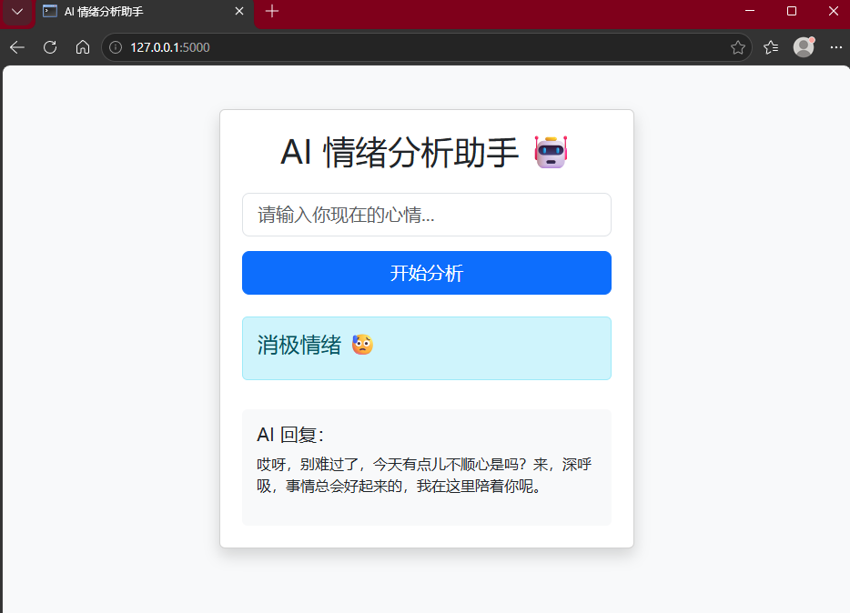

# AI Emotion Analysis Assistant 🤖

一个基于 Flask + 智谱 AI 的情绪分析 Web 应用。

用户输入一句话后，
系统会自动分析用户情绪，
并在检测到消极情绪时，
通过 AI 自动生成安慰回复。

---

# 项目演示

## 用户输入
```text
最近压力特别大
```

## AI 输出

```text
消极情绪 😥

别太逼自己，
很多事情都需要慢慢来。
```

---

# 项目截图


---

# 技术栈

- Python
- Flask
- HTML
- Bootstrap 5
- Jinja2
- 智谱 AI（GLM-4）

---

# 项目功能

✅ AI 自动情绪分析  
✅ Web 页面实时交互  
✅ 消极情绪 AI 安慰回复  
✅ Bootstrap 页面美化  
✅ Flask 后端处理  
✅ 表单提交与数据交互  

---

# 项目结构

```bash
emotion_web/
│
├── app.py
├── templates/
│   └── index.html
│
│
└── README.md
```

---

# 安装依赖

## 安装 Flask

```bash
pip install flask
```

## 安装智谱 AI SDK

```bash
pip install zhipuai
```

---

# 配置 API Key

打开：

```python
app.py
```

修改：

```python
client = ZhipuAI(
    api_key="你的API_KEY"
)
```

API Key 获取地址：

https://open.bigmodel.cn/

---

# 启动项目

```bash
python app.py
```

浏览器打开：

```text
http://127.0.0.1:5000
```

---

# 核心功能实现

## Flask 路由

```python
@app.route("/", methods=["GET", "POST"])
```

用于处理网页请求。

---

## 获取用户输入

```python
text = request.form.get("text")
```

用于接收用户输入内容。

---

## AI 情绪分析

通过调用智谱 AI：

```python
client.chat.completions.create()
```

自动分析用户情绪。

---

## AI 安慰回复

当检测到消极情绪时：

- 自动生成安慰内容
- 提升用户交互体验

---

# 页面优化

项目使用 Bootstrap 5：

- 卡片布局
- 阴影效果
- 响应式页面
- 美化输入框与按钮

---

# 后续可升级方向

- 用户登录系统
- SQLite 数据库
- 聊天记录保存
- 多轮 AI 对话
- 深色模式
- Docker 部署
- 云服务器上线

---

# 学习收获

通过本项目学习了：

- Flask Web 开发
- HTML 表单交互
- Bootstrap 页面美化
- API 调用
- Prompt Engineering
- AI Web 项目开发

---

# 作者

Python 学习者 / AI Web 开发方向