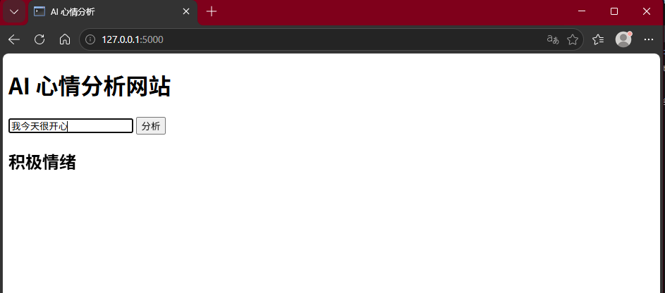

# 简易情绪分析工具

一个基于 Flask 的轻量级 Web 应用，通过关键词匹配判断输入文本的情绪倾向：积极、消极或无明显情绪。

## 功能特点

- 接收用户输入的文本
- 匹配内置关键词：
  - 积极词：`开心`、`高兴`、`喜欢`、`快乐`、`棒`
  - 消极词：`难过`、`压力`、`伤心`、`烦躁`、`累`
- 返回情绪分类结果：
  - 积极情绪
  - 消极情绪
  - 情绪不明显（未匹配到任何关键词）

## 技术栈

- Python 3.x
- Flask（Web 框架）

## 快速开始

### 1. 克隆或下载项目

将代码保存为 `app.py`，并创建 `templates` 文件夹，在其中新建 `index.html` 文件（见下方“前端模板”）。

### 2. 安装依赖

```bash
pip install flask